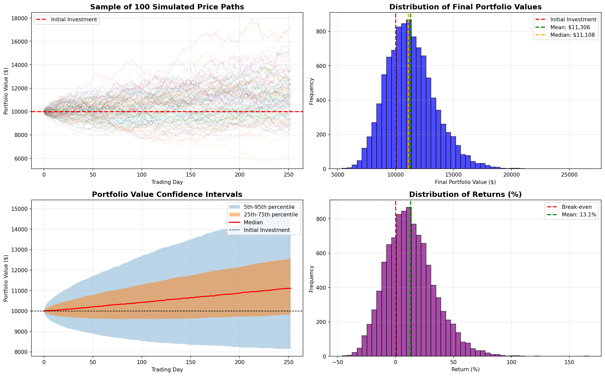
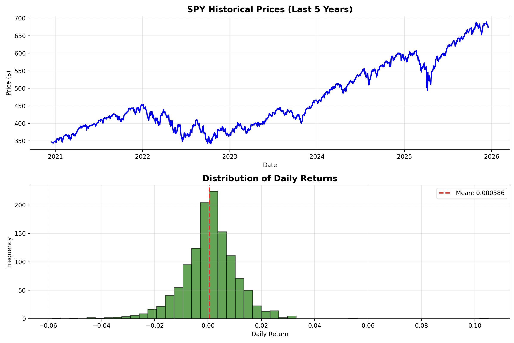

# 📊 Monte Carlo Portfolio Simulator


A sophisticated Python-based financial modeling tool that uses Monte Carlo simulation to analyze and visualize potential investment outcomes using Geometric Brownian Motion (GBM).

## 🎯 Project Overview

This project simulates **10,000 possible future scenarios** for stock portfolio returns, providing comprehensive risk analysis and data-driven insights for investment decision-making. By leveraging historical market data and stochastic modeling, it quantifies uncertainty and visualizes the full spectrum of potential outcomes.

### Key Features

- 📈 **Automated Data Pipeline**: Downloads and processes historical stock data via Yahoo Finance API
- 🧮 **Statistical Analysis**: Calculates drift (μ) and volatility (σ) from real market data
- 🎲 **Monte Carlo Engine**: Runs 10,000+ simulations using Geometric Brownian Motion
- 📊 **Rich Visualizations**: Four comprehensive charts showing price paths, distributions, and confidence intervals
- 📉 **Risk Metrics**: Calculates percentiles, probability of profit, and worst/best case scenarios

## 🖼️ Sample Output

### Simulation Results Dashboard


*The dashboard includes: (1) Sample price paths, (2) Distribution of outcomes, (3) Confidence intervals over time, (4) Return distribution*

### Historical Data Analysis


*Historical S&P 500 prices and daily return distribution used for parameter estimation*

## 🚀 Getting Started

### Prerequisites

- Python 3.7 or higher
- pip package manager

### Installation

1. **Clone the repository**
```bash
git clone https://github.com/yourusername/monte-carlo-portfolio.git
cd monte-carlo-portfolio
```

2. **Create a virtual environment (recommended)**
```bash
python -m venv venv

# Activate on Windows
venv\Scripts\activate

# Activate on Mac/Linux
source venv/bin/activate
```

3. **Install dependencies**
```bash
pip install -r requirements.txt
```

### Quick Start

1. **Run data analysis** to download historical data and calculate parameters:
```bash
python data_analysis.py
```

This will:
- Download 5 years of S&P 500 (SPY) data
- Calculate mean daily returns and volatility
- Generate historical analysis charts
- Display drift (μ) and volatility (σ) parameters

2. **Run Monte Carlo simulation** using the calculated parameters:
```bash
python monte_carlo_simulation.py
```

This will:
- Simulate 10,000 price paths over 252 trading days (1 year)
- Generate comprehensive visualization dashboard
- Display statistical risk metrics

## 📁 Project Structure
```
monte-carlo-portfolio/
│
├── data_analysis.py              # Historical data analysis & parameter calculation
├── monte_carlo_simulation.py     # Monte Carlo simulation engine
├── requirements.txt              # Python dependencies
├── README.md                     # Project documentation
├── .gitignore                   # Git ignore file
│
├── outputs/                      # Generated charts and results
│   ├── spy_analysis.png
│   └── monte_carlo_simulation.png
│
└── venv/                        # Virtual environment (not tracked)
```

## 🔬 Technical Details

### Mathematical Foundation

The project implements **Geometric Brownian Motion (GBM)**, the standard model for stock price dynamics:
```
S(t+Δt) = S(t) × exp[(μ - σ²/2)Δt + σ√Δt × Z]
```

Where:
- **S(t)** = Stock price at time t
- **μ** = Drift (expected annual return)
- **σ** = Volatility (annual standard deviation)
- **Δt** = Time step (1/252 for daily increments)
- **Z** = Random shock from standard normal distribution N(0,1)

### Parameter Estimation

**Drift (μ):**
```python
daily_returns = prices.pct_change()
mean_daily_return = daily_returns.mean()
annual_return = mean_daily_return * 252  # Annualize
```

**Volatility (σ):**
```python
daily_volatility = daily_returns.std()
annual_volatility = daily_volatility * np.sqrt(252)  # Annualize
```

### Simulation Process

1. Initialize portfolio at $10,000
2. For each of 10,000 simulations:
   - Generate 252 random daily shocks
   - Apply GBM formula to calculate daily prices
   - Store complete price path
3. Analyze distribution of final values
4. Calculate risk metrics and generate visualizations

## 📊 Understanding the Results

### Statistical Metrics

| Metric | Description |
|--------|-------------|
| **Mean** | Average final portfolio value across all simulations |
| **Median** | Middle value (50th percentile) |
| **5th Percentile** | Worst case for 95% of scenarios (VaR proxy) |
| **95th Percentile** | Best case for 95% of scenarios |
| **Std Deviation** | Measure of outcome variability |
| **Probability of Profit** | Percentage of simulations ending above initial investment |

### Interpreting Visualizations

**Chart 1: Price Paths**
- Shows 100 sample trajectories
- Illustrates range of possible outcomes
- Demonstrates market randomness

**Chart 2: Distribution**
- Histogram of final portfolio values
- Shows most likely outcomes
- Indicates probability of different results

**Chart 3: Confidence Intervals**
- Shaded bands show range over time
- Dark band = middle 50% of outcomes
- Light band = middle 90% of outcomes
- Demonstrates growing uncertainty

**Chart 4: Return Distribution**
- Shows profit/loss percentages
- Normal distribution centered around expected return
- Visualizes risk-reward profile

## 🛠️ Customization

### Modify Simulation Parameters

Edit `monte_carlo_simulation.py`:
```python
# Change initial investment
initial_investment = 50000  # $50,000

# Change time horizon
time_horizon = 252 * 5  # 5 years instead of 1

# Change number of simulations
num_simulations = 50000  # More simulations = smoother distribution
```

### Try Different Assets

Edit `data_analysis.py`:
```python
# Change ticker symbol
ticker = yf.Ticker("AAPL")  # Apple instead of S&P 500
# or
ticker = yf.Ticker("BTC-USD")  # Bitcoin
# or
ticker = yf.Ticker("GLD")  # Gold ETF
```

### Adjust Time Period
```python
# Change historical data period
data = ticker.history(period="10y")  # 10 years instead of 5
```

## 📚 Key Concepts Explained

### What is Monte Carlo Simulation?

A computational technique that uses repeated random sampling to model complex systems with uncertainty. In finance, it's used to:
- Model investment risk
- Price complex derivatives
- Optimize portfolio allocation
- Stress test strategies

### What is Geometric Brownian Motion?

A mathematical model that assumes:
- Stock prices follow a log-normal distribution
- Returns are normally distributed
- Prices exhibit both drift (trend) and volatility (randomness)

**Real-world application:** Used by quants at hedge funds and investment banks for risk modeling.

### Why These Results Matter

- **For Investors**: Understand realistic range of outcomes, not just "average" returns
- **For Risk Management**: Quantify worst-case scenarios (5th percentile)
- **For Planning**: See how likely you are to meet financial goals
- **For Strategy**: Compare different investment approaches objectively

## ⚠️ Limitations & Assumptions

This model assumes:
- ✓ Constant drift and volatility (reality: they change over time)
- ✓ Log-normal price distribution (reality: fat tails exist)
- ✓ No transaction costs or taxes
- ✓ Continuous trading (reality: market closes)
- ✓ Independent returns (reality: autocorrelation exists)

**This is an educational tool, not investment advice.**

## 🚧 Future Enhancements

Potential improvements:

- [ ] Multi-asset portfolio simulation with correlation
- [ ] Stochastic volatility models (GARCH, Heston)
- [ ] Jump-diffusion to model crashes
- [ ] Dollar-cost averaging simulation
- [ ] Interactive web interface (Streamlit/Dash)
- [ ] Comparison of multiple strategies
- [ ] Transaction costs and tax implications
- [ ] Mean reversion models
- [ ] Value at Risk (VaR) and CVaR metrics
- [ ] Backtesting framework

## 🤝 Contributing

Contributions are welcome! Please feel free to submit a Pull Request.

1. Fork the repository
2. Create your feature branch (`git checkout -b feature/AmazingFeature`)
3. Commit your changes (`git commit -m 'Add some AmazingFeature'`)
4. Push to the branch (`git push origin feature/AmazingFeature`)
5. Open a Pull Request

## 📖 Resources & References

- **Black-Scholes Model**: Foundation of options pricing using GBM
- **Modern Portfolio Theory**: Markowitz optimization framework
- **Quantitative Finance**: Hull's "Options, Futures, and Other Derivatives"
- **Python for Finance**: Yves Hilpisch's book series

## 📄 License

This project is licensed under the MIT License - see the [LICENSE](LICENSE) file for details.

## 🙏 Acknowledgments

- Yahoo Finance for providing free historical data API
- NumPy and Pandas communities for excellent documentation
- Matplotlib for powerful visualization capabilities
- The quantitative finance community for educational resources


